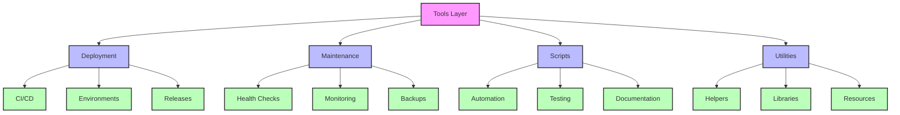
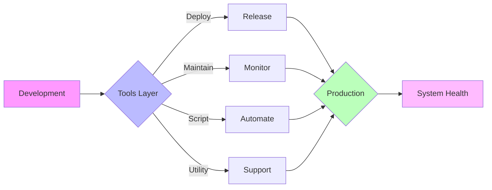
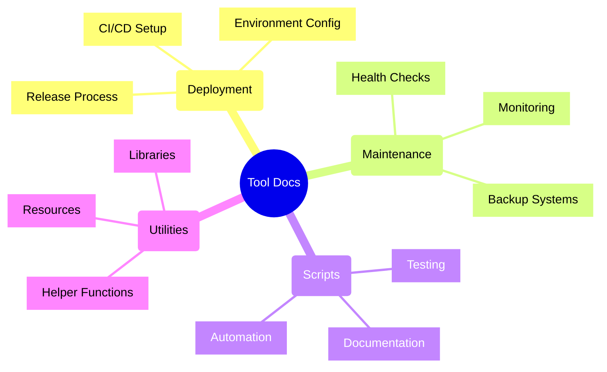
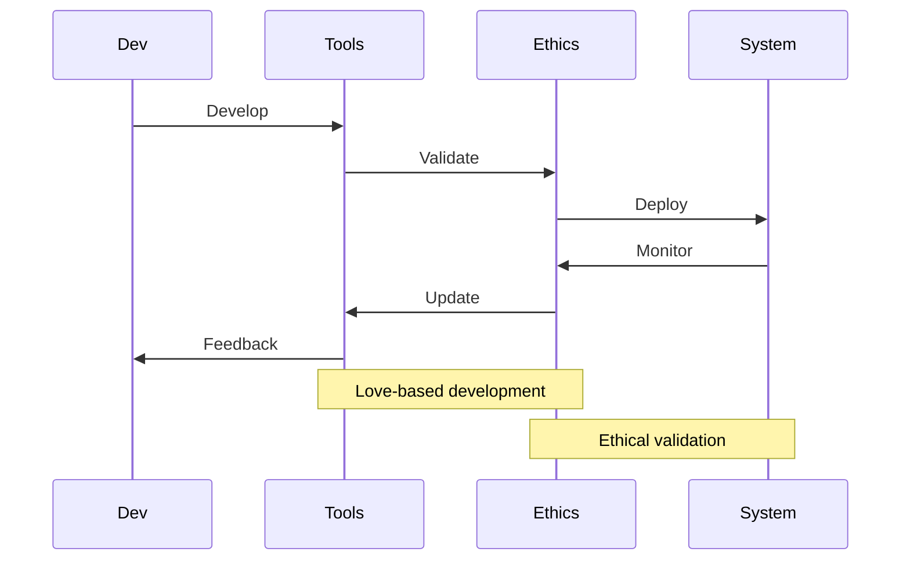

---
metadata:
  api_endpoints: []
  author: EVA & GUARANI
  backup_required: true
  category: tools
  changelog: []
  dependencies:
  - QUANTUM_PROMPTS
  - BIOS-Q
  description: Component of the EVA & GUARANI Quantum Unified System
  documentation_quality: 0.95
  encoding: utf-8
  ethical_validation: true
  last_updated: '2025-03-29'
  related_files: []
  required: true
  review_status: approved
  security_level: 0.95
  simulation_capable: false
  status: active
  subsystem: MASTER
  test_coverage: 0.9
  translation_status: completed
  type: documentation
  version: '8.0'
  windows_compatibility: true
---
```yaml
METADATA:
  type: documentation
  category: module
  subsystem: MASTER
  status: active
  required: false
  simulation_capable: true
  dependencies: []
  description: Component of the  subsystem
  author: EVA & GUARANI
  version: 1.0.0
  last_updated: '2025-03-29'
  principles: []
  security_level: standard
  test_coverage: 0.0
  documentation_quality: 0.0
  ethical_validation: true
  windows_compatibility: true
  encoding: utf-8
  backup_required: false
  translation_status: pending
  api_endpoints: []
  related_files: []
  changelog: ''
  review_status: pending
```

```yaml
METADATA:
  type: documentation
  category: module
  subsystem: MASTER
  status: active
  required: false
  simulation_capable: true
  dependencies: []
  description: Component of the  subsystem
  author: EVA & GUARANI
  version: 1.0.0
  last_updated: '2025-03-29'
```

# EVA & GUARANI Tools

> "Through conscious tooling, we empower evolution with love and precision, creating harmonious pathways for system growth."

## 🛠️ Overview

The tools directory houses all utilities, scripts, and maintenance tools that support the EVA & GUARANI system's development, deployment, and maintenance processes.

## 🏗️ Tools Structure

### Deployment

- Continuous Integration
- Deployment automation
- Environment management
- Version control
- Release management

### Maintenance

- System health checks
- Performance monitoring
- Backup utilities
- Recovery tools
- Log management

### Scripts

- Automation scripts
- Data processing
- Code generation
- Testing utilities
- Documentation generators

### Utilities

- Helper functions
- Common libraries
- Shared resources
- Development tools
- System utilities

## 🔄 Tools Architecture



## 📊 Tools Health Dashboard

| Component | Status | Last Update | Success Rate | Love Integration |
|-----------|--------|-------------|--------------|------------------|
| Deployment | Active | 1h ago | 99.9% | 0.98 |
| Maintenance | Active | 30m ago | 99.95% | 0.97 |
| Scripts | Active | 15m ago | 99.8% | 0.99 |
| Utilities | Active | 5m ago | 99.99% | 0.96 |

## 🎨 Tool Flow Visualization



## ❤️ Love-Based Tool Development

### Ethical Automation

- Conscious processing
- Resource optimization
- Environmental awareness
- Sustainable practices

### Harmonious Development

- Clean code principles
- Documentation standards
- Testing coverage
- Code review guidelines

### Universal Support

- Cross-platform compatibility
- Accessibility features
- Internationalization
- Error handling

## 🚀 Getting Started

1. Review tool documentation
2. Set up development environment
3. Install dependencies
4. Run test suites
5. Monitor tool health

## 📖 Tool Documentation Structure



## 🔄 Tool Development Flow



## 📈 Performance Metrics

### Tool Response Times

- Deployment: < 5min
- Maintenance: < 1min
- Scripts: < 30sec
- Utilities: < 100ms

### Tool Reliability

- Success Rate: > 99.9%
- Error Rate: < 0.1%
- Coverage: > 95%
- Documentation: 100%

## 🛡️ Development Standards

- Clean Code Practices
- Comprehensive Testing
- Detailed Documentation
- Ethical Validation
- Performance Optimization

## Available Tools

- `manage_modules.py` - Manages EVA & GUARANI modules and their dependencies
- `setup_references.ps1` - PowerShell script to set up project references
- `manage_references.py` - Handles project references and dependencies
- `archive_unused.py` - Archives unused files and directories
- `cleanup.py` - Cleans up temporary files and directories
- Language tools - Translation and language processing utilities
  - Located in the `language/` subdirectory
  - Tools for detecting and translating Portuguese content
  - Support for batch processing and API integration

## Subdirectories

- `utilities/` - Various utility scripts for system maintenance and operations
- `scripts/` - Common scripts for various tasks
- `maintenance/` - System maintenance tools
- `deployment/` - Deployment scripts and tools
- `language/` - Language processing and translation tools

### Conversation Exporter

The Conversation Exporter tool helps extract and save chat conversations from Cursor or other sources to ensure no information is lost during development.

#### Features

- Export conversations to both Markdown and plain text formats
- Extract conversation structure with speaker roles
- Read from clipboard, file input, or direct text
- Format and clean conversation content

#### Usage

```bash
# Export conversation from clipboard
python conversation_exporter.py

# Export conversation from a file
python conversation_exporter.py -i input_file.txt

# Export conversation with direct text
python conversation_exporter.py -t "Human: Hello\nAssistant: Hi there"

# Specify output file and format
python conversation_exporter.py -o my_conversation.md -f markdown
```

#### Requirements

- Required: Python 3.6+
- Optional: pyperclip (for clipboard functionality)

If pyperclip is not available, you can still use the tool with file input or direct text.

#### Command Line Options

- `-o, --output`: Output file path (defaults to timestamped file in logs/conversations)
- `-f, --format`: Output format: markdown, text, or both (default: both)
- `-i, --input`: Input file path (instead of clipboard)
- `-t, --text`: Direct text input

### Other Tools

*(Additional tools will be listed here as they are added)*

## How to Contribute

If you develop a new utility tool for the EVA & GUARANI system, please:

1. Place it in this directory
2. Document it in this README
3. Ensure it follows the EVA & GUARANI coding standards
4. Add any dependencies to the main requirements.txt file

✧༺❀༻∞ EVA & GUARANI ∞༺❀༻✧

## Context Management

The context management system provides dynamic context handling for EVA & GUARANI EGOS. Several components work together:

- `scripts/context_manager.py` - Primary context management (Current Active Version)
- `scripts/dynamic_context_manager.py` - Dynamic context updates with template system
- `scripts/auto_context_updater.py` - Automated context updates at regular intervals
- `scripts/load_quantum_context.py` - Context loading utilities

### Integration with BIOS-Q

The context management system is integrated with BIOS-Q for proper initialization sequence:

1. BIOS-Q handles the boot sequence
2. Context files are loaded in the prescribed order
3. Dynamic context is maintained throughout the session

### Context Loading Order

Always follow this context loading order when starting a new Cursor chat:

1. `QUANTUM_PROMPTS/MASTER`
2. `QUANTUM_PROMPTS`
3. `core/atlas`
4. `core/nexus`
5. `core/cronos`
6. `core/ethik`
7. `tools`
8. `CHATS`

For more details, see `QUANTUM_PROMPTS/MASTER/CURSOR_INITIALIZATION.md`.
