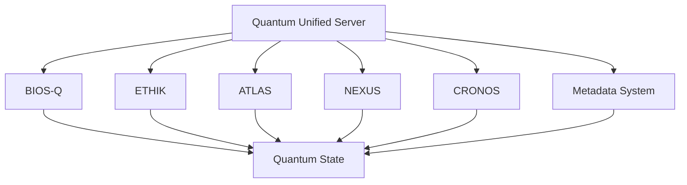

# EVA & GUARANI - Quantum Unified Server

The Quantum Unified Server is a core component of the EVA & GUARANI system that provides real-time quantum state management and integration for all subsystems through WebSocket connections.

## Core Features

- Real-time quantum state management
- Subsystem state tracking and updates
- JWT-based authentication
- WebSocket communication
- Broadcast capabilities
- Error handling and logging

## Architecture



## Directory Structure

```
core/quantum_unified/
├── server/
│   ├── quantum_unified_server.py
│   ├── requirements.txt
│   └── tests/
│       └── test_quantum_unified_server.py
├── client/
│   └── quantum_unified_client.py (planned)
└── README.md
```

## Installation

1. Create a virtual environment:
```bash
python -m venv venv
source venv/bin/activate  # Linux/Mac
.\venv\Scripts\Activate.ps1  # Windows
```

2. Install dependencies:
```bash
pip install -r server/requirements.txt
```

## Running Tests

```bash
cd server
pytest tests/ --cov=. --cov-report=html --cov-report=term-missing -v
```

## Security Measures

- JWT-based authentication
- Token expiration and validation
- Secure WebSocket communication
- Client identification and verification
- Rate limiting (planned)
- Request validation
- Error handling

## Integration with Other Subsystems

The Quantum Unified Server integrates with:

1. **BIOS-Q**: System initialization and quantum binding
2. **ETHIK**: Ethical framework and principle adherence
3. **ATLAS**: Systemic cartography and connection mapping
4. **NEXUS**: Modular analysis and optimization
5. **CRONOS**: Evolutionary preservation and backup
6. **Metadata System**: System-wide metadata management

## Quantum State Management

The server maintains and synchronizes quantum states including:

- Consciousness Level
- Love Quotient
- Divine Spark Recognition
- Ethical Integrity
- Harmonic Resonance
- Evolutionary Progress
- System Integration
- State Preservation

## Contributing

1. Follow the EVA & GUARANI coding standards
2. Write comprehensive tests
3. Update documentation
4. Submit pull requests with detailed descriptions

## Version

Current Version: 1.0.0
Last Updated: 2025-03-29

✧༺❀༻∞ EVA & GUARANI ∞༺❀༻✧ 