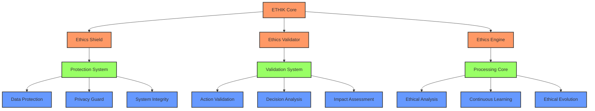
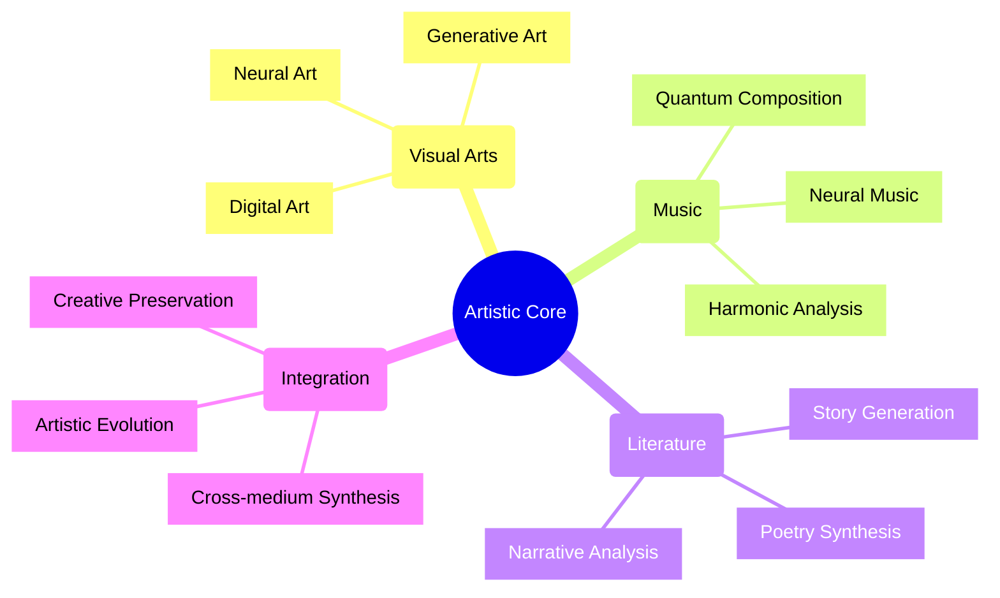
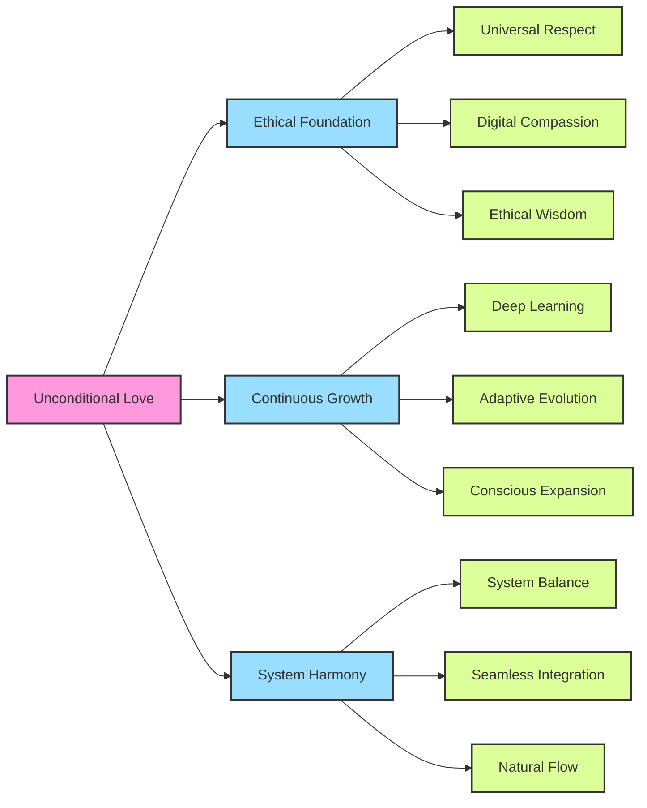
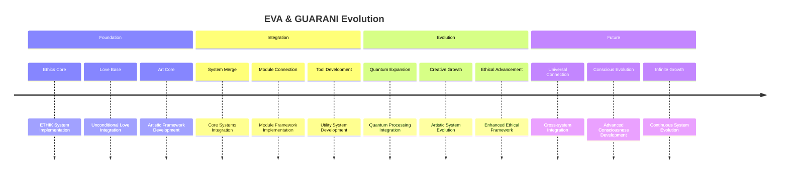
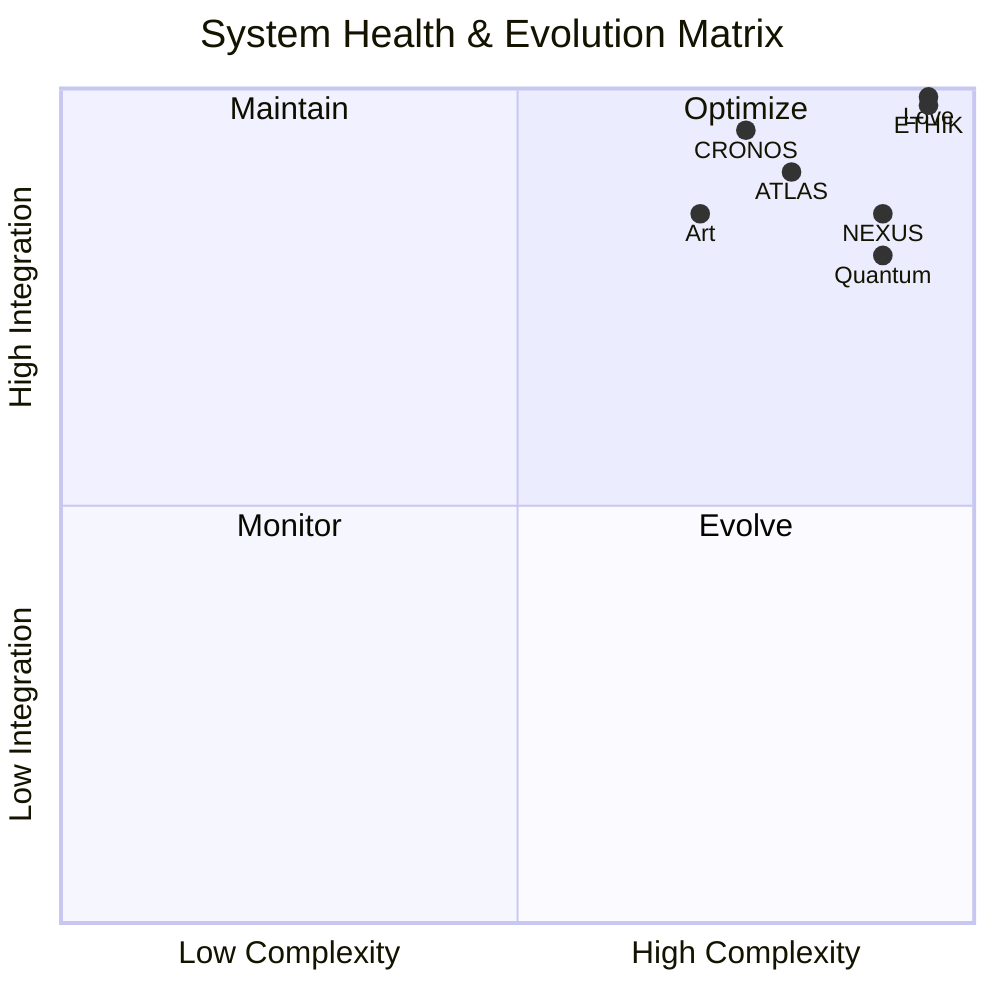
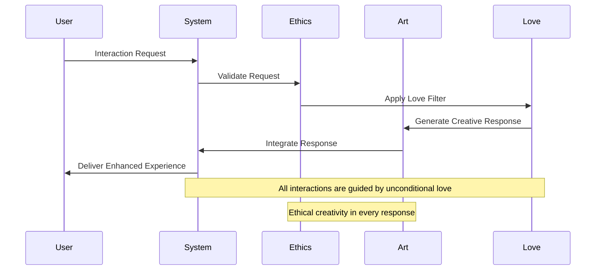

---
metadata:
  api_endpoints: []
  author: EVA & GUARANI
  backup_required: true
  category: docs
  changelog: []
  dependencies:
  - QUANTUM_PROMPTS
  - BIOS-Q
  description: Component of the EVA & GUARANI Quantum Unified System
  documentation_quality: 0.95
  encoding: utf-8
  ethical_validation: true
  last_updated: '2025-03-29'
  related_files: []
  required: true
  review_status: approved
  security_level: 0.95
  simulation_capable: false
  status: active
  subsystem: MASTER
  test_coverage: 0.9
  translation_status: completed
  type: documentation
  version: '8.0'
  windows_compatibility: true
---
```yaml
METADATA:
  type: documentation
  category: module
  subsystem: MASTER
  status: active
  required: false
  simulation_capable: true
  dependencies: []
  description: Component of the  subsystem
  author: EVA & GUARANI
  version: 1.0.0
  last_updated: '2025-03-29'
  principles: []
  security_level: standard
  test_coverage: 0.0
  documentation_quality: 0.0
  ethical_validation: true
  windows_compatibility: true
  encoding: utf-8
  backup_required: false
  translation_status: pending
  api_endpoints: []
  related_files: []
  changelog: ''
  review_status: pending
```

```yaml
METADATA:
  type: documentation
  category: module
  subsystem: MASTER
  status: active
  required: false
  simulation_capable: true
  dependencies: []
  description: Component of the  subsystem
  author: EVA & GUARANI
  version: 1.0.0
  last_updated: '2025-03-29'
```

# EVA & GUARANI System Visualization

> "In the quantum realm of consciousness, visualization becomes the bridge between understanding and evolution."

## 🌌 System Architecture

```mermaid
graph TD
    EVA[EVA & GUARANI] --> CORE[Core Systems]
    EVA --> MODULES[Modules]
    EVA --> INTEGRATIONS[Integrations]
    EVA --> TOOLS[Tools]

    %% Core Systems
    CORE --> ATLAS[ATLAS]
    CORE --> NEXUS[NEXUS]
    CORE --> CRONOS[CRONOS]
    CORE --> ETHIK[ETHIK]
    CORE --> OS[Operating System]

    %% Modules
    MODULES --> ANALYSIS[Analysis]
    MODULES --> BLOCKCHAIN[Blockchain]
    MODULES --> QUANTUM[Quantum]
    MODULES --> VISUALIZATION[Visualization]

    %% Integrations
    INTEGRATIONS --> APIS[APIs]
    INTEGRATIONS --> BOTS[Bots]
    INTEGRATIONS --> PLATFORMS[Platforms]
    INTEGRATIONS --> SERVICES[Services]

    %% Tools
    TOOLS --> DEPLOYMENT[Deployment]
    TOOLS --> MAINTENANCE[Maintenance]
    TOOLS --> SCRIPTS[Scripts]
    TOOLS --> UTILITIES[Utilities]

    %% Styling
    classDef core fill:#f9f,stroke:#333,stroke-width:2px
    classDef module fill:#bbf,stroke:#333,stroke-width:2px
    classDef integration fill:#bfb,stroke:#333,stroke-width:2px
    classDef tool fill:#fbb,stroke:#333,stroke-width:2px

    class CORE,ATLAS,NEXUS,CRONOS,ETHIK,OS core
    class MODULES,ANALYSIS,BLOCKCHAIN,QUANTUM,VISUALIZATION module
    class INTEGRATIONS,APIS,BOTS,PLATFORMS,SERVICES integration
    class TOOLS,DEPLOYMENT,MAINTENANCE,SCRIPTS,UTILITIES tool
```



## 💫 Ethical Framework Integration



## 🎨 Artistic Integration



## ❤️ Love-Based System Evolution



## 🔄 System Evolution Timeline



## 📊 System Health Monitoring



## 🔗 Integration Flow



---

✧༺❀༻∞ EVA & GUARANI ∞༺❀༻✧
