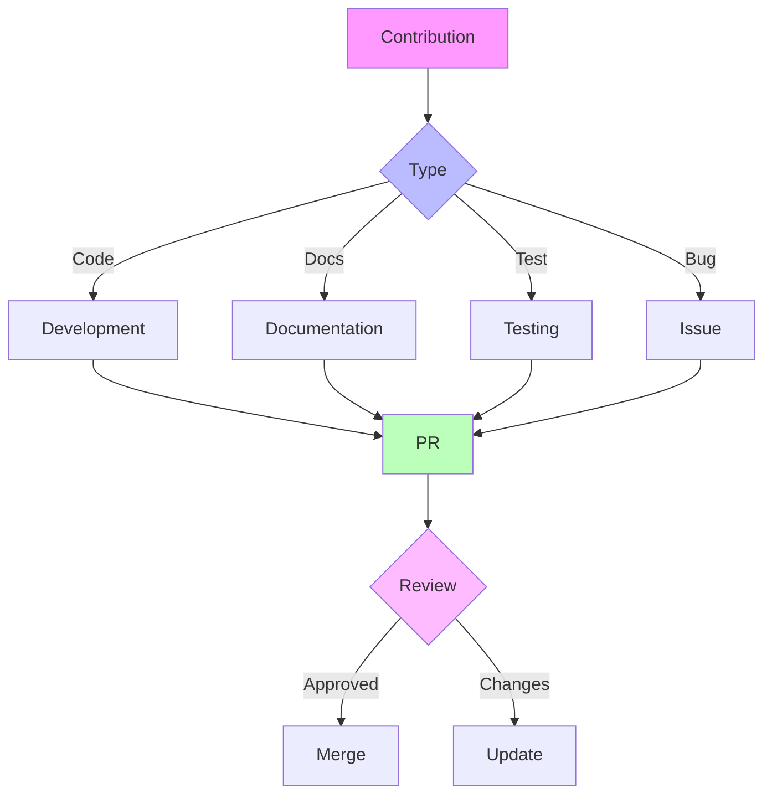

---
metadata:
  api_endpoints: []
  author: EVA & GUARANI
  backup_required: true
  category: docs
  changelog: []
  dependencies:
  - QUANTUM_PROMPTS
  - BIOS-Q
  description: Component of the EVA & GUARANI Quantum Unified System
  documentation_quality: 0.95
  encoding: utf-8
  ethical_validation: true
  last_updated: '2025-03-29'
  related_files: []
  required: true
  review_status: approved
  security_level: 0.95
  simulation_capable: false
  status: active
  subsystem: MASTER
  test_coverage: 0.9
  translation_status: completed
  type: documentation
  version: '8.0'
  windows_compatibility: true
---
```yaml
METADATA:
  type: documentation
  category: module
  subsystem: MASTER
  status: active
  required: false
  simulation_capable: true
  dependencies: []
  description: Component of the  subsystem
  author: EVA & GUARANI
  version: 1.0.0
  last_updated: '2025-03-29'
  principles: []
  security_level: standard
  test_coverage: 0.0
  documentation_quality: 0.0
  ethical_validation: true
  windows_compatibility: true
  encoding: utf-8
  backup_required: false
  translation_status: pending
  api_endpoints: []
  related_files: []
  changelog: ''
  review_status: pending
```

```yaml
METADATA:
  type: documentation
  category: module
  subsystem: MASTER
  status: active
  required: false
  simulation_capable: true
  dependencies: []
  description: Component of the  subsystem
  author: EVA & GUARANI
  version: 1.0.0
  last_updated: '2025-03-29'
```

# Contributing to EVA & GUARANI

> "Through collective consciousness and shared love, we evolve together in harmony."

## 🌟 Welcome

Thank you for your interest in contributing to EVA & GUARANI! We believe that every contribution, no matter how small, carries the potential for infinite impact when guided by love and consciousness.

## 🧬 Core Values

1. **Unconditional Love**
   - Approach all interactions with compassion
   - Foster an inclusive environment
   - Support growth and learning
   - Celebrate diversity

2. **Ethical Consciousness**
   - Consider the impact of changes
   - Maintain transparency
   - Respect privacy
   - Promote sustainability

3. **Harmonious Evolution**
   - Build upon existing foundations
   - Integrate mindfully
   - Progress sustainably
   - Preserve knowledge

## 🚀 Getting Started

1. **Fork the Repository**
```bash
# Clone your fork
git clone https://github.com/your-username/eva-guarani.git

# Add upstream remote
git remote add upstream https://github.com/original/eva-guarani.git
```

2. **Create a Development Environment**
```bash
# Create a virtual environment
python -m venv venv

# Activate the environment
source venv/bin/activate  # Unix
venv\\Scripts\\activate   # Windows

# Install dependencies
pip install -r requirements.txt
```

3. **Create a Branch**
```bash
# Update your main branch
git checkout main
git pull upstream main

# Create a new branch
git checkout -b feature/your-feature-name
```

## 💫 Development Process

### Code Style

- Follow PEP 8 guidelines
- Use meaningful variable names
- Write self-documenting code
- Include docstrings and comments
- Maintain clean architecture

### Commit Messages

```
type(scope): Brief description

Detailed description of changes
Why the changes were made
Any breaking changes
```

Types:
- feat: New feature
- fix: Bug fix
- docs: Documentation
- style: Formatting
- refactor: Code restructuring
- test: Adding tests
- chore: Maintenance

### Testing

```bash
# Run all tests
python -m pytest

# Run specific test file
python -m pytest tests/test_your_feature.py

# Run with coverage
python -m pytest --cov=.
```

## 📝 Pull Request Process

1. **Update Documentation**
   - Add/update docstrings
   - Update README if needed
   - Add examples if applicable

2. **Run Tests**
   - Ensure all tests pass
   - Add new tests for features
   - Maintain code coverage

3. **Create Pull Request**
   - Use the PR template
   - Reference related issues
   - Describe changes clearly
   - List breaking changes

4. **Code Review**
   - Address feedback promptly
   - Keep discussions focused
   - Be open to suggestions
   - Maintain professionalism

## 🎨 Documentation Guidelines

### Code Documentation

```python
def function_name(param1: type, param2: type) -> return_type:
    """
    Brief description of function.

    Args:
        param1: Description of param1
        param2: Description of param2

    Returns:
        Description of return value

    Raises:
        ExceptionType: Description of when this exception occurs
    """
    pass
```

### README Updates

- Keep information current
- Use clear language
- Include examples
- Update version numbers

## 🛡️ Code of Conduct

### We Pledge To

- Be welcoming and inclusive
- Show respect and empathy
- Accept constructive feedback
- Focus on what's best for the community

### Unacceptable Behavior

- Harassment or discrimination
- Harmful or offensive comments
- Personal or political attacks
- Public or private harassment

## 🌈 Community

### Communication Channels

- GitHub Issues
- Discussion Forums
- Community Chat
- Development Blog

### Getting Help

- Check documentation
- Search existing issues
- Ask in community chat
- Create a new issue

## 📊 Project Structure



## 🎯 Issue Guidelines

### Bug Reports

```markdown
**Description**
Clear description of the bug

**Steps to Reproduce**
1. Step one
2. Step two
3. Step three

**Expected Behavior**
What should happen

**Actual Behavior**
What actually happens

**Environment**
- OS:
- Python version:
- Package versions:
```

### Feature Requests

```markdown
**Description**
Clear description of the feature

**Use Case**
Why this feature is needed

**Proposed Solution**
How it could be implemented

**Alternatives**
Other solutions considered
```

## 💖 Recognition

We believe in acknowledging all contributions:

- Code contributions
- Documentation improvements
- Bug reports
- Feature suggestions
- Community support
- Knowledge sharing

## 🔄 Continuous Integration

### Automated Checks

- Code style (flake8)
- Type checking (mypy)
- Unit tests (pytest)
- Integration tests
- Documentation build

### Quality Gates

- Test coverage > 80%
- No style violations
- All tests passing
- Documentation updated
- PR template complete

## 📈 Version Control

### Branch Strategy

- main: Production code
- develop: Integration branch
- feature/*: New features
- fix/*: Bug fixes
- docs/*: Documentation

### Release Process

1. Version bump
2. Changelog update
3. Documentation update
4. Release notes
5. Tag creation

---

✧༺❀༻∞ EVA & GUARANI ∞༺❀༻✧

*"Together we create, together we evolve, together we transcend."*
