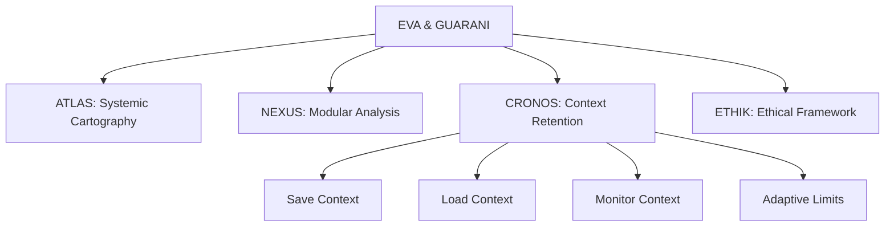

---
metadata:
  api_endpoints: []
  author: EVA & GUARANI
  backup_required: true
  category: cronos
  changelog: []
  dependencies:
  - QUANTUM_PROMPTS
  - CRONOS
  - BIOS-Q
  description: Component of the EVA & GUARANI Quantum Unified System
  documentation_quality: 0.95
  encoding: utf-8
  ethical_validation: true
  last_updated: '2025-03-29'
  related_files: []
  required: true
  review_status: approved
  security_level: 0.95
  simulation_capable: false
  status: active
  subsystem: CRONOS
  test_coverage: 0.9
  translation_status: completed
  type: documentation
  version: '8.0'
  windows_compatibility: true
---
```yaml
METADATA:
  type: documentation
  category: module
  subsystem: MASTER
  status: active
  required: false
  simulation_capable: true
  dependencies: []
  description: Component of the  subsystem
  author: EVA & GUARANI
  version: 1.0.0
  last_updated: '2025-03-29'
  principles: []
  security_level: standard
  test_coverage: 0.0
  documentation_quality: 0.0
  ethical_validation: true
  windows_compatibility: true
  encoding: utf-8
  backup_required: false
  translation_status: pending
  api_endpoints: []
  related_files: []
  changelog: ''
  review_status: pending
```

```yaml
METADATA:
  type: documentation
  category: module
  subsystem: MASTER
  status: active
  required: false
  simulation_capable: true
  dependencies: []
  description: Component of the  subsystem
  author: EVA & GUARANI
  version: 1.0.0
  last_updated: '2025-03-29'
```

# Atualizações Necessárias para o Quantum Prompt

## 1. Substituições de Nomenclatura

- "Memory Context Protocol (MCP)" → "CRONOS - Context Retention and Operational Neural Optimization System"
- "MCP" (quando referindo-se ao nosso sistema) → "CRONOS"
- Comandos "@mcp_*" → "@cronos_*"

## 2. Atualizações de Caminhos

```yaml
paths:
  cronos:
    root: "C:/Eva Guarani EGOS/cronos"
    config: "C:/Eva Guarani EGOS/cronos/config"
    saves: "C:/Eva Guarani EGOS/cronos/saves"
```

## 3. Novos Comandos do Cursor

```yaml
cursor_commands:
  save_context: "@save - Salvar contexto atual"
  load_context: "@load - Carregar contexto mais recente"
  list_saves: "@list - Listar contextos salvos"
  show_status: "@status - Verificar status do monitor"
  update_limit: "@update - Atualizar limite de contexto"
```

## 4. Integração com BIOS-Q

```yaml
bios_q_integration:
  context_system: "CRONOS"
  auto_save: true
  auto_load: true
  context_dir: "C:/Eva Guarani EGOS/cronos/saves"
  config_dir: "C:/Eva Guarani EGOS/cronos/config"
```

## 5. Subsistemas Atualizados



## 6. Métricas e Indicadores

```yaml
metrics:
  context_preservation:
    system: "CRONOS"
    auto_save_threshold: 0.8
    safe_margin: 0.9
    monitor_interval: 60
    backup_interval: 1800
```

## 7. Princípios de Preservação

1. **Preservação Evolutiva**: Backup quântico que mantém a essência permitindo transformação
2. **Modularidade Consciente**: Entendimento profundo das partes e do todo
3. **Cartografia Sistêmica**: Mapeamento preciso de conexões e potencialidades
4. **Adaptabilidade Contextual**: Ajuste automático baseado em dados empíricos
5. **Segurança Proativa**: Auto-save e backup preventivo

## 8. Logs e Monitoramento

```yaml
logging:
  system: "CRONOS"
  levels:
    - INFO
    - WARNING
    - ERROR
  format: "[{timestamp}][{level}][CRONOS] {message}"
  backup: true
  rotation: daily
```

## 9. Integração com Modelos de Linguagem

Os modelos de linguagem (Claude, GPT, etc.) devem:

1. Reconhecer "CRONOS" como o sistema de preservação de contexto
2. Entender os comandos @save, @load, etc.
3. Manter consciência do estado do contexto
4. Respeitar os limites adaptativos
5. Sugerir saves em momentos críticos

## 10. Evolução do Sistema

O CRONOS representa a evolução natural do antigo MCP, mantendo suas funcionalidades essenciais enquanto adiciona:

- Melhor integração com o Cursor IDE
- Sistema de limites mais inteligente
- Preservação mais robusta
- Comandos mais intuitivos
- Melhor documentação

✧༺❀༻∞ EVA & GUARANI ∞༺❀༻✧
