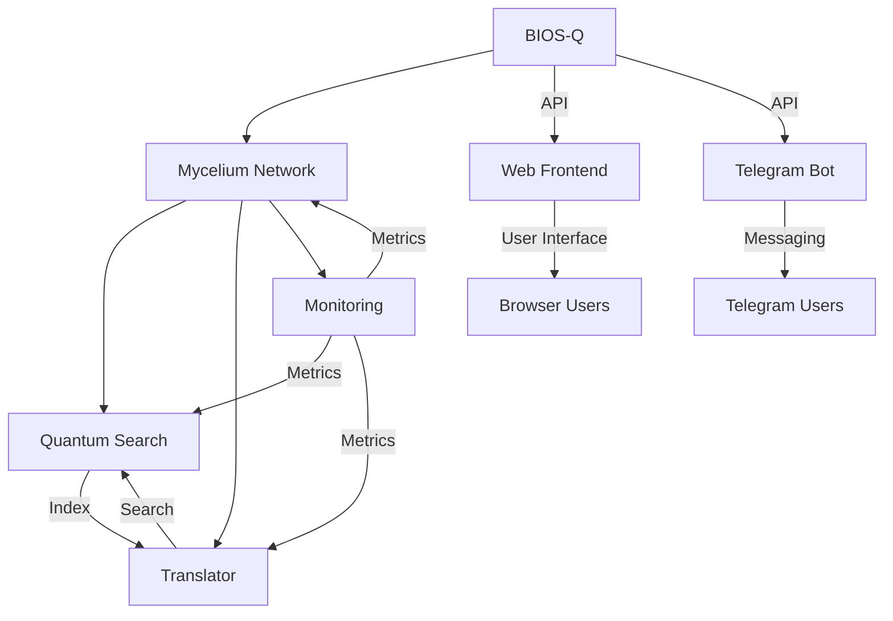

---
metadata:
  api_endpoints: []
  author: EVA & GUARANI
  backup_required: true
  category: BIOS-Q
  changelog: []
  dependencies:
  - QUANTUM_PROMPTS
  - BIOS-Q
  description: Component of the EVA & GUARANI Quantum Unified System
  documentation_quality: 0.95
  encoding: utf-8
  ethical_validation: true
  last_updated: '2025-03-29'
  related_files: []
  required: true
  review_status: approved
  security_level: 0.95
  simulation_capable: false
  status: active
  subsystem: BIOS-Q
  test_coverage: 0.9
  translation_status: completed
  type: documentation
  version: '8.0'
  windows_compatibility: true
---
```yaml
METADATA:
  type: documentation
  category: module
  subsystem: MASTER
  status: active
  required: false
  simulation_capable: true
  dependencies: []
  description: Component of the  subsystem
  author: EVA & GUARANI
  version: 1.0.0
  last_updated: '2025-03-29'
  principles: []
  security_level: standard
  test_coverage: 0.0
  documentation_quality: 0.0
  ethical_validation: true
  windows_compatibility: true
  encoding: utf-8
  backup_required: false
  translation_status: pending
  api_endpoints: []
  related_files: []
  changelog: ''
  review_status: pending
```

```yaml
METADATA:
  type: documentation
  category: module
  subsystem: MASTER
  status: active
  required: false
  simulation_capable: true
  dependencies: []
  description: Component of the  subsystem
  author: EVA & GUARANI
  version: 1.0.0
  last_updated: '2025-03-29'
```

# EVA & GUARANI - BIOS-Q v8.0

> "At the intersection of modular analysis, systemic cartography, and quantum ethics, we transcend dimensions of thought with methodological precision and unconditional love."

## Overview

EVA & GUARANI BIOS-Q is a quantum-inspired system that integrates multiple advanced capabilities through a mycelial network architecture. It provides intelligent search, multilingual translation, and comprehensive monitoring across all subsystems.

Version: 8.0  
Created: 2025-03-28

## Core Systems

### 1. Mycelium Network

The foundational system that connects and coordinates all other components through a neural-like network architecture. It enables:

- Dynamic node registration and connection
- Real-time data propagation
- Adaptive routing and load balancing
- Self-healing network topology
- ETHICHAIN integration for ethical validation

### 2. Quantum Search

An intelligent search system that provides:

- Quantum-inspired search algorithms
- Real-time indexing and updates
- Contextual relevance scoring
- Integration with the Mycelium network

### 3. Translation System

A multilingual capability provider offering:

- Support for 13 languages
- Translation memory and caching
- Batch translation processing
- Integration with search and monitoring

### 4. Monitoring System

Comprehensive observability through:

- Prometheus metrics collection
- Grafana dashboard visualization
- Real-time system statistics
- Performance monitoring

## Platform Integration

```
                      ┌─────────────────┐
                      │   BIOS-Q Core   │
                      │  (Python/API)   │
                      └────────┬────────┘
                               │
                ┌──────────────┴───────────────┐
                │                              │
        ┌───────┴────────┐            ┌───────┴────────┐
        │  Web Frontend  │            │  Telegram Bot  │
        │   (JS/React)   │            │    (Python)    │
        └───────┬────────┘            └───────┬────────┘
                │                              │
      ┌─────────┴──────────┐          ┌───────┴────────┐
      │ Browser (All OS)   │          │ Telegram App   │
      │ (Web Application)  │          │ (All Platforms)│
      └────────────────────┘          └────────────────┘
```

### Primary Platforms

#### Web Application

Our main interface is a modern web application built with:

- FastAPI backend for REST API endpoints
- React frontend for responsive dashboard
- D3.js for interactive visualizations
- WebSocket integration for real-time updates
- Progressive Web App capabilities for offline access

#### Telegram Bot

For mobile and messaging-based access:

- Built with python-telegram-bot library
- Commands that map directly to core functions
- Conversation flows that mirror the mycelial network
- File and media sharing capabilities
- Cross-platform accessibility

### Future Platforms

- **Desktop Application**: Electron-based wrapper for the web interface
- **Mobile Applications**: React Native implementations for iOS/Android
- **API Integration**: SDK for third-party developers

## Communicating EVA & GUARANI's Essence

### Conceptual Map Visualization

- Interactive visualization of the mycelial network
- Visual representation of quantum connections between subsystems
- Real-time data flow visualization

### ATLAS-First Implementation

The ATLAS subsystem, focused on systemic cartography, serves as the foundation of our user-facing experience:

- Map-based navigation of system capabilities
- Visual exploration of the project's structure
- Topographical representation of data relationships

### Multi-Layered Documentation

Our documentation follows a progressive disclosure approach:

- **Layer 1**: Visual metaphors (mycelium network, quantum connections)
- **Layer 2**: Interactive demonstrations of core capabilities
- **Layer 3**: Technical documentation with increasing complexity

## Installation

1. Clone the repository:

```bash
git clone https://github.com/your-org/eva-guarani-bios-q.git
cd eva-guarani-bios-q
```

2. Create a virtual environment:

```bash
python -m venv venv
source venv/bin/activate  # On Windows: venv\Scripts\activate
```

3. Install dependencies:

```bash
pip install -r requirements.txt
```

4. Set up environment variables:

```bash
cp .env.example .env
# Edit .env with your configuration
```

## Configuration

### Environment Variables

Create a `.env` file with the following variables:

```env
# Grafana Configuration
GRAFANA_URL=http://localhost:3000
GRAFANA_API_KEY=your-api-key

# Prometheus Configuration
PROMETHEUS_PORT=9090

# System Configuration
LOG_LEVEL=INFO
MYCELIUM_SYNC_INTERVAL=15
QUANTUM_SEARCH_CACHE_SIZE=1000
TRANSLATION_MEMORY_SIZE=5000
```

### Prometheus Setup

1. Install Prometheus
2. Add the following to your `prometheus.yml`:

```yaml
scrape_configs:
  - job_name: 'eva-guarani'
    static_configs:
      - targets: ['localhost:9090']
```

### Grafana Setup

1. Install Grafana
2. Import the dashboard from `dashboards/eva-guarani-dashboard.json`
3. Configure Prometheus as a data source

## Usage

### Starting the System

1. Start the core systems:

```python
from bios_q.core import mycelium_network, quantum_search, translator, monitoring

# The systems will automatically initialize and connect
```

2. Perform a quantum search:

```python
results = await quantum_search.search("quantum mycelium integration")
```

3. Translate content:

```python
translation = await translator.translate(
    "Hello, quantum world!",
    target_lang="pt"
)
```

4. Monitor system metrics:

```python
stats = monitoring.get_stats()
print(f"Connected Nodes: {stats['connected_nodes']}")
print(f"Last Update: {stats['last_update']}")
```

### Development

1. Run tests:

```bash
pytest tests/
```

2. Format code:

```bash
black .
isort .
```

3. Type checking:

```bash
mypy .
```

## Architecture



## Implementation Roadmap

| Phase | Focus Area | Key Deliverables | Timeline |
|-------|------------|------------------|----------|
| 1 | BIOS-Q Core & API | Core functionality, REST API, initial documentation | Q2 2024 |
| 2 | Web Interface | Dashboard, ATLAS visualizations, mycelial network viewer | Q2-Q3 2024 |
| 3 | Telegram Bot | Basic commands, core functionality access | Q3 2024 |
| 4 | Enhanced Visualization | Interactive data flow, quantum connections | Q3-Q4 2024 |
| 5 | Multi-Layered Documentation | Visual metaphors, interactive guides, technical docs | Q4 2024 |
| 6 | Cross-Platform Expansion | Electron desktop app, mobile experience optimization | Q1 2025 |

## Contributing

1. Fork the repository
2. Create a feature branch
3. Make your changes
4. Run tests and type checking
5. Submit a pull request

## License

This project is licensed under the MIT License - see the LICENSE file for details.

## Acknowledgments

- The EVA & GUARANI team
- Contributors and maintainers
- The quantum computing community

✧༺❀༻∞ EVA & GUARANI ∞༺❀༻✧

# BIOS-Q MCP

BIOS-Q MCP (Mycelium Control Protocol) é o sistema de inicialização quântico para o ambiente EVA & GUARANI. Ele é responsável por gerenciar a comunicação entre os diferentes MCPs e garantir a inicialização correta do sistema.

## Requisitos

- Python 3.9 ou superior
- pip (gerenciador de pacotes Python)
- Git

## Instalação

1. Clone o repositório:

```bash
git clone <repository_url>
cd BIOS-Q
```

2. Crie e ative um ambiente virtual:

```bash
python -m venv venv
source venv/Scripts/activate  # Windows
# ou
source venv/bin/activate     # Linux/macOS
```

3. Instale as dependências:

```bash
pip install -e .[dev]
```

## Uso

Para iniciar o BIOS-Q MCP, execute:

```bash
./start_bios_q.bat  # Windows
# ou
./start_bios_q.sh   # Linux/macOS
```

O BIOS-Q MCP iniciará e estabelecerá uma conexão persistente com o Cursor IDE.

## Desenvolvimento

### Executando Testes

Para executar os testes:

```bash
pytest
```

Para executar os testes com cobertura:

```bash
pytest --cov=mcp --cov-report=html
```

### Estrutura do Projeto

```
BIOS-Q/
├── mcp/                    # Código fonte do MCP
│   ├── __init__.py
│   └── bios_q_mcp.py      # Implementação principal
├── tests/                  # Testes
│   └── test_bios_q_mcp.py
├── config/                 # Arquivos de configuração
│   └── bios_q_config.json
├── setup.py               # Configuração do pacote
├── pytest.ini            # Configuração do pytest
├── requirements.txt      # Dependências do projeto
├── start_bios_q.bat     # Script de inicialização (Windows)
└── start_bios_q.sh      # Script de inicialização (Linux/macOS)
```

## Licença

Este projeto é parte do sistema EVA & GUARANI e está sob a licença especificada no arquivo LICENSE.
