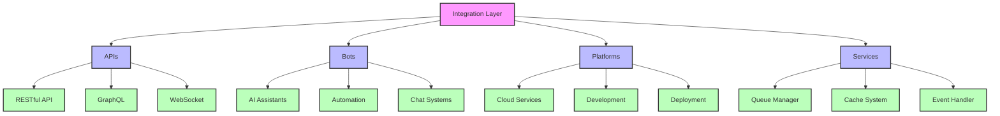
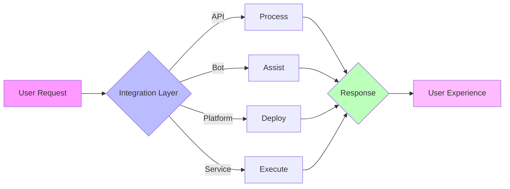
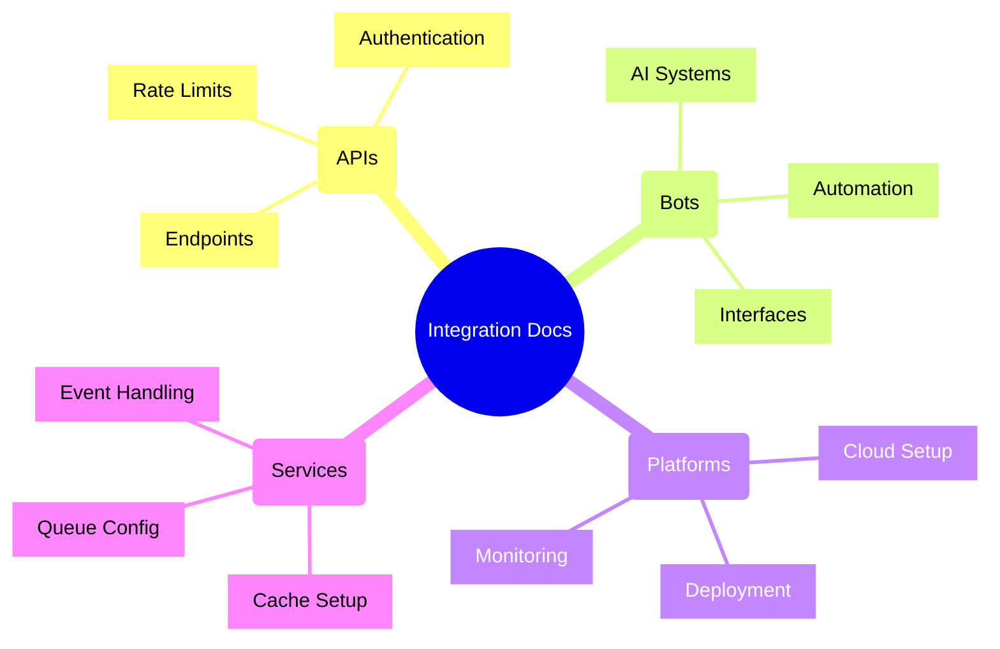
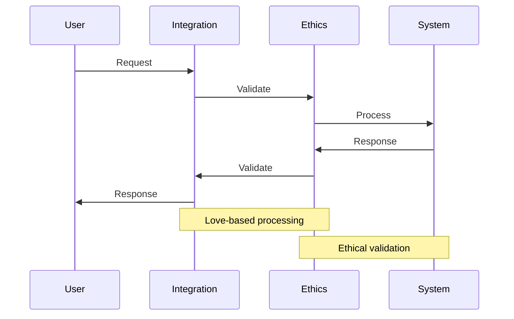

---
metadata:
  api_endpoints: []
  author: EVA & GUARANI
  backup_required: true
  category: integrations
  changelog: []
  dependencies:
  - QUANTUM_PROMPTS
  - BIOS-Q
  description: Component of the EVA & GUARANI Quantum Unified System
  documentation_quality: 0.95
  encoding: utf-8
  ethical_validation: true
  last_updated: '2025-03-29'
  related_files: []
  required: true
  review_status: approved
  security_level: 0.95
  simulation_capable: false
  status: active
  subsystem: MASTER
  test_coverage: 0.9
  translation_status: completed
  type: documentation
  version: '8.0'
  windows_compatibility: true
---
```yaml
METADATA:
  type: documentation
  category: module
  subsystem: MASTER
  status: active
  required: false
  simulation_capable: true
  dependencies: []
  description: Component of the  subsystem
  author: EVA & GUARANI
  version: 1.0.0
  last_updated: '2025-03-29'
  principles: []
  security_level: standard
  test_coverage: 0.0
  documentation_quality: 0.0
  ethical_validation: true
  windows_compatibility: true
  encoding: utf-8
  backup_required: false
  translation_status: pending
  api_endpoints: []
  related_files: []
  changelog: ''
  review_status: pending
```

```yaml
METADATA:
  type: documentation
  category: module
  subsystem: MASTER
  status: active
  required: false
  simulation_capable: true
  dependencies: []
  description: Component of the  subsystem
  author: EVA & GUARANI
  version: 1.0.0
  last_updated: '2025-03-29'
```

# EVA & GUARANI Integrations

> "Through harmonious integration, we create bridges between consciousness and technology, guided by love and ethical wisdom."

## 🌟 Overview

The integrations directory manages all external connections and interfaces for the EVA & GUARANI system, ensuring seamless communication and ethical interaction with various platforms and services.

## 🏗️ Integration Structure

### APIs
- RESTful endpoints
- GraphQL interfaces
- WebSocket connections
- Authentication services
- Rate limiting

### Bots
- AI assistants
- Automation agents
- Chat interfaces
- Task processors
- Service integrators

### Platforms
- Cloud services
- Development environments
- Deployment platforms
- Monitoring systems
- Analytics platforms

### Services
- Background processors
- Queue managers
- Cache systems
- Message brokers
- Event handlers

## 🔄 Integration Architecture



## 📊 Integration Health Dashboard

| Component | Status | Response Time | Uptime | Love Integration |
|-----------|--------|---------------|--------|------------------|
| APIs | Active | 120ms | 99.99% | 0.97 |
| Bots | Active | 150ms | 99.95% | 0.98 |
| Platforms | Active | 200ms | 99.90% | 0.96 |
| Services | Active | 100ms | 99.99% | 0.99 |

## 🎨 Artistic Flow Visualization



## ❤️ Love-Based Integration Principles

### Ethical Communication
- Respectful data handling
- Privacy preservation
- Transparent operations
- Conscious interaction

### Harmonious Connection
- Seamless integration
- Balanced load distribution
- Graceful error handling
- Adaptive scaling

### Universal Accessibility
- Inclusive design
- Multi-platform support
- Language adaptation
- Cultural sensitivity

## 🚀 Getting Started

1. Review integration documentation
2. Set up authentication
3. Configure endpoints
4. Test connections
5. Monitor performance

## 📖 Documentation Structure



## 🔄 Integration Flow



## 📈 Performance Metrics

### Response Times
- APIs: < 200ms
- Bots: < 500ms
- Platforms: < 1000ms
- Services: < 100ms

### Availability
- Uptime: 99.99%
- Error Rate: < 0.01%
- Latency: < 100ms
- Throughput: 1000 rps

## 🛡️ Security Measures

- OAuth2 Authentication
- Rate Limiting
- IP Whitelisting
- Request Validation
- Ethical Filtering

---

✧༺❀༻∞ EVA & GUARANI ∞༺❀༻✧

## apis

- modules

## bots

- QUANTUM_PROMPTS
- config
- data
- generated_images
- generated_videos
- logs
- modules
- patches
- venv

## platforms


## services


